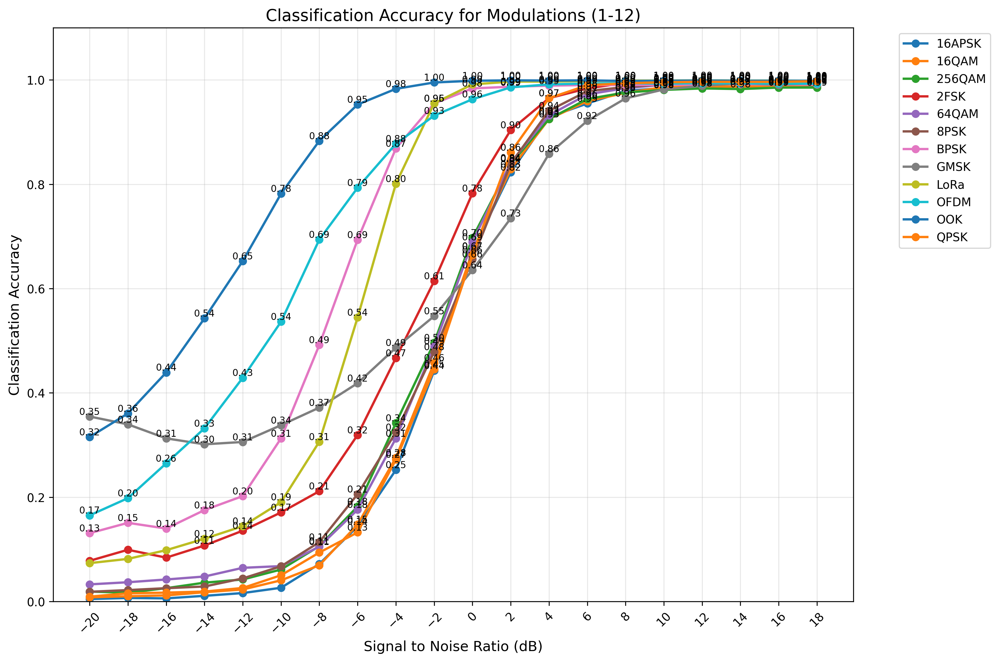
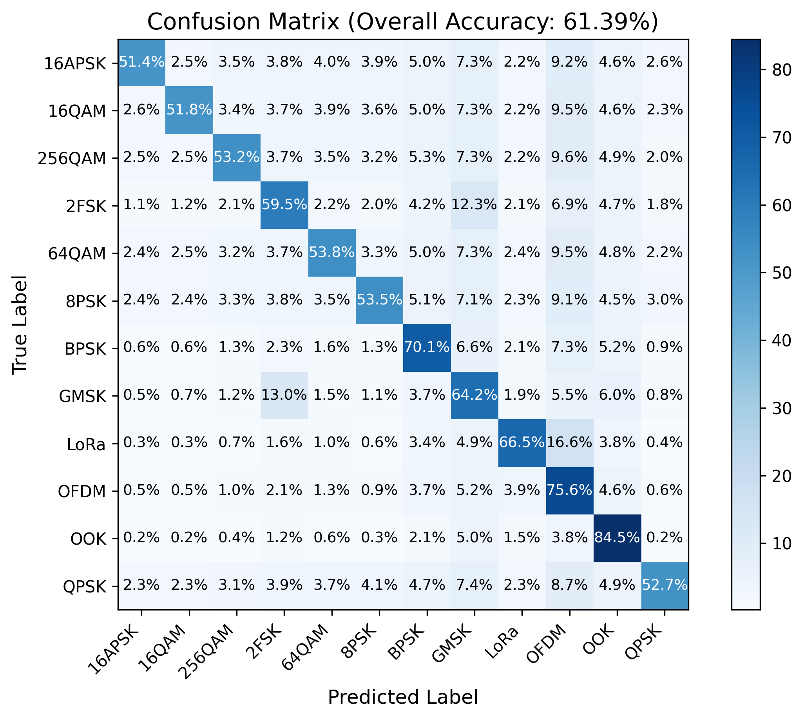

# Indoor Over-the-Air Modulation Recognition Dataset

## Overview

This dataset contains **over-the-air (OTA)** recordings of 12 digital modulation schemes, collected in a controlled indoor environment. It is specifically designed for **automatic modulation classification (AMC)** research, providing a realistic benchmark for evaluating deep learning models under varying SNR conditions.

The data generation and collection were performed by the **Software Defined System Studio (SDS Studio)**, a platform independently developed by the Broad-band Communication and Network Group (BCNG) of the National University of Defense Technology, in conjunction with a Universal Software Radio Peripheral . All signals were transmitted and received in a controlled indoor environment, including real radio frequency impairments and channel impairments.

The dataset is stored in a single HDF5 (`.h5`) or NumPy NPZ (`.npz`) file, with predefined training, validation, and test splits. Each sample consists of **I/Q complex samples** along with its modulation label and SNR value.

***

## Download

The dataset is permanently archived on Zenodo and can be downloaded freely under the CC BY 4.0 license.

[](https://doi.org/10.5281/zenodo.19244450)

### Direct download links
- **HDF5 version**: [Indoor-OTA-12Mod.h5](https://zenodo.org/records/19244451/files/Indoor-OTA-12Mod.h5)
- **NPZ version**: [Indoor-OTA-12Mod.npz](https://zenodo.org/records/19244451/files/Indoor-OTA-12Mod.npz)

### Command-line download (Linux/macOS/WSL)
```bash
# Download HDF5 file
wget https://zenodo.org/records/19244451/files/Indoor-OTA-12Mod.h5

# Download NPZ file
wget https://zenodo.org/records/19244451/files/Indoor-OTA-12Mod.npz
```

***

## Modulation Types

The dataset includes the following 12 modulation classes:

* **BPSK**, **QPSK**, **8PSK**

* **16QAM**, **64QAM**, **256QAM**

* **2FSK**, **GMSK**, **OOK**

* **16APSK**, **OFDM**, **LoRa**

***

## Data Collection

* **Environment**: Indoor laboratory with controlled multipath and noise.

* **Hardware**: USRP, Pluto, SDS Studio, etc.

* **Center frequency**: 2.42 GHz

* **Bandwidth**: 20 MHz

* **Sampling rate**: 1MHz

* **SNR range**: -20 dB to 18 dB, step 2 dB

* **Samples per signal**: 128 complex symbols (256 real values)

* **Total number of samples**: 3932160

***

## File Format and Structure

The dataset is provided as a single file:
`Indoor-OTA-12Mod.h5` (or `Indoor-OTA-12Mod.npz`).

Inside the file, the following datasets/groups are available:

| Key                                                                                                           | Description                                           |
| ------------------------------------------------------------------------------------------------------------- | ----------------------------------------------------- |
| `train_data`      | Training samples, shape `(N_train, 256)` – each row is 256 real values (I/Q interleaved). |                                                       |
| `train_labels`    | String labels for training samples, shape `(N_train,)`.                                   |                                                       |
| `train_snrs`      | SNR values (in dB) for training samples, shape `(N_train,)`.                              |                                                       |
| `val_data`        | Validation samples, shape `(N_val, 256)`.                                                 |                                                       |
| `val_labels`      | String labels for validation samples, shape `(N_val,)`.                                   |                                                       |
| `val_snrs`        | SNR values for validation samples, shape `(N_val,)`.                                      |                                                       |
| `test_data`       | Test samples, shape `(N_test, 256)`.                                                      |                                                       |
| `test_labels`     | String labels for test samples, shape `(N_test,)`.                                        |                                                       |
| `test_snrs`       | SNR values for test samples, shape `(N_test,)`.                                           |                                                       |
| `modulation_types`                                                                                            | List of all modulation classes (strings).             |
| `target_snrs`                                                                                                 | List of SNR levels present in the dataset (integers). |

**Note**: The raw data is stored as **256 real numbers per sample**, representing 128 complex I/Q samples in interleaved format (I1, Q1, I2, Q2, ...). To use in complex-valued neural networks, reshape to `(N, 2, 128)`.

***

## Dataset Split

The dataset is pre-split into **training**, **validation**, and **test** sets. The split is **stratified** by modulation type and SNR to ensure balanced distribution across all classes and conditions.

* **Training set**: 70% of total samples

* **Validation set**: 15%

* **Test set**: 15%

No overlapping samples exist between splits.

***

## Usage Example (Python)

Below is a minimal example to load the dataset using the provided loader class (`dataset_Loader.py`). The loader automatically handles both `.h5` and `.npz` formats

````python
from dataset_Loader import DatasetLoader

# Load the dataset
(mods, snrs, lbl), (X_train, Y_train), (X_val, Y_val), (X_test, Y_test), idx, Xd = \
    DatasetLoader.load_rml_dataset('path/to/dataset.h5')

# X_train shape: (N_train, 2, 128)  after reshaping inside the loader
# Y_train shape: (N_train, num_classes) one-hot encoded labels

print(f"Modulation types: {mods}")
print(f"SNR levels: {snrs}")
print(f"Training samples: {X_train.shape[0]}")
print(f"Validation samples: {X_val.shape[0]}")
print(f"Test samples: {X_test.shape[0]}")```
````

Alternatively, you can directly read the file using h5py or numpy:

```python
import h5py
import numpy as np

with h5py.File('dataset.h5', 'r') as f:
    X_train = f['train_data'][:]          # shape (N_train, 256)
    y_train = f['train_labels'][:]        # strings
    snr_train = f['train_snrs'][:]

    # Reshape to (N, 2, 128)
    X_train = X_train.reshape(-1, 2, 128)
```

For .npz:

````python
data = np.load('dataset.npz', allow_pickle=True)
X_train = data['train_data'].reshape(-1, 2, 128)
y_train = data['train_labels']```
````

## CNN Classification Results

The following figures show the classification performance of a CNN model on the OTA-ModSet dataset.

**Accuracy vs. SNR**


**Confusion Matrix**


## Citation

If you use this dataset in your research, please cite:

```bibtex
@dataset{Penguin8867_OTA-ModSet_2026,
  author = {Qier Qin and NUDT BCNG Team},
  title = {OTA-ModSet: An Over-the-Air Modulation Recognition Dataset},
  year = {2026},
  publisher    = {Zenodo},
  version      = {v1.0},
  doi          = {10.5281/zenodo.19244450},
  url          = {https://doi.org/10.5281/zenodo.19244450}
}
```

## License

This dataset is released under the Creative Commons Attribution 4.0 International (CC BY 4.0) license.
You are free to share and adapt the material for any purpose, provided appropriate credit is given to the authors and a link to the license is included.

## Contact

For questions, suggestions, or collaboration, please open an issue on GitHub or contact the maintainer at [qinqier24@nudt.edu.cn].
